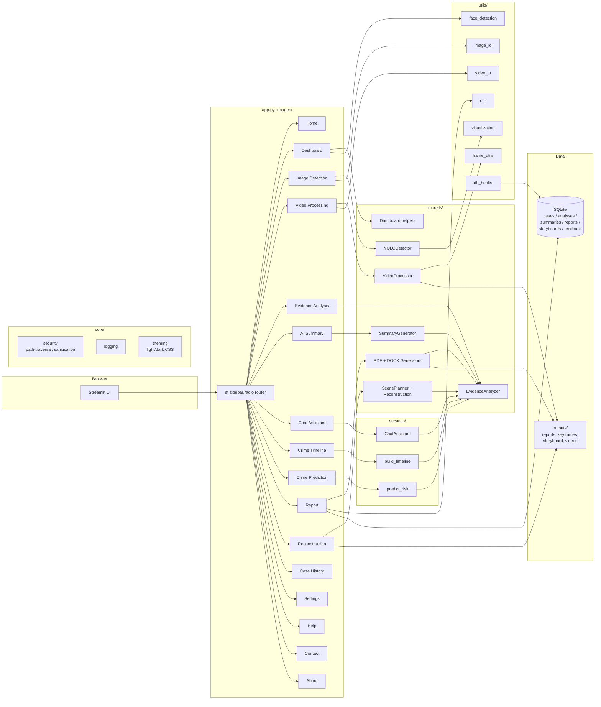

# Architecture

This document describes the runtime architecture of the
**AI-Based Crime Investigation Assistant** (Phase 13 release).

## High-level diagram

## Request lifecycle — “image uploaded → report downloaded”

1. The user picks **Image Detection** in the sidebar.
2. `pages/image_detection.py` validates the upload with
   `utils.image_io.load_image_from_bytes()`.
3. The shared `YOLODetector` singleton from
   `pages/_state.get_yolo_detector()` runs the model and returns
   a `DetectionResult`.
4. The page writes `last_detection` into `st.session_state` and
   the auto-save hook (`utils/db_hooks.auto_save_last_analysis()`)
   persists a row in `analyses` and (if needed) `cases`.
5. The user proceeds to **Evidence Analysis** →
   `models.evidence_analyzer.analyze()` produces an
   `EvidenceAnalysis` from the detection.
6. **AI Summary** → `models.summary_generator.SummaryGenerator`
   builds the deterministic template and (optionally) rewrites it
   with FLAN-T5.
7. **Report** → `models.report_generator.build_report_data()`
   + `PDFReportGenerator` / `DOCXReportGenerator` produce the file
   and `utils/db_hooks.auto_save_last_report()` persists the row.

Every cross-layer contract is a frozen dataclass in
`models/schemas.py`, so no module reaches into another module's
internals.

## Layer responsibilities

| Layer | Responsibility | Streamlit-aware? |
|---|---|---|
| `app/` | HTTP façade (no UI use) | no |
| `core/` | logging, security, theming | no |
| `services/` | orchestration, business flows | no |
| `models/` | detection / generation / analysis | no |
| `utils/` | I/O + small helpers | no |
| `database/` | SQLite repository | no |
| `pages/` | Streamlit UI per feature | yes |
| `app.py` | bootstrap + routing | yes |

The “Streamlit-aware” column is the contract: everything in
`pages/` may import `streamlit`; nothing else may.

## Configuration

Every value in `config/settings.py` either:

- has a constant default, **or**
- is read from an environment variable with a safe fallback
  (e.g. `APP_PORT`, `APP_THEME`, `LOG_LEVEL`).

`config/__init__.py` re-exports every public name so callers
import `from config import APP_NAME` instead of reaching into the
sub-module.

## Security posture

- `core.security.safe_filename` strips path components and unsafe
  characters from every user-supplied filename.
- `core.security.safe_join` is the only function allowed to combine
  a server-side directory with a user-supplied filename; it raises
  `PathTraversalError` on escapes.
- Every SQL statement uses parameterised queries; no string
  concatenation reaches the database.
- File uploads are size- and extension-checked before they hit disk
  (`utils.image_io`, `utils.video_io`).
- All free-text input is length-bounded and stripped of control
  characters (`core.security.validate_text_input`).

## Performance notes

- Heavy models (YOLOv8, FLAN-T5) are loaded **once** per session
  via Streamlit’s `cache_resource` pattern (see
  `pages/_state.get_yolo_detector()` and
  `pages/ai_summary._get_generator()`).
- `core.theming` keeps a single string literal per theme and
  injects it once per page render — no per-element style
  recomputation.
- `app.api.dispatch` is a small constant-time registry; adding a
  new endpoint never regresses existing ones.

## Where to look for a feature

| If you’re looking for… | Open this file |
|---|---|
| A new model wrapper | `models/` |
| A new business rule | `services/` |
| A new sidebar page | `pages/` (mirror `pages/about.py`) |
| A new env var | `config/settings.py` |
| A new DB table | `database/db.py` (DDL) + `database/repository.py` (CRUD) |
| A new theme token | `core/theming.py` |
| A new HTTP route | `app/__init__.py` (`@register(...)`) |
