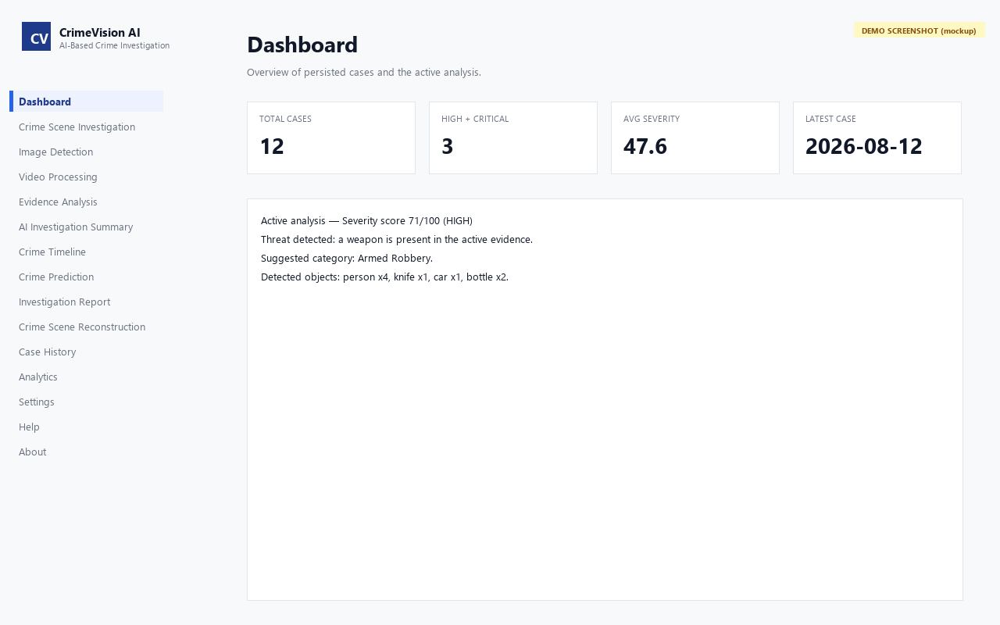
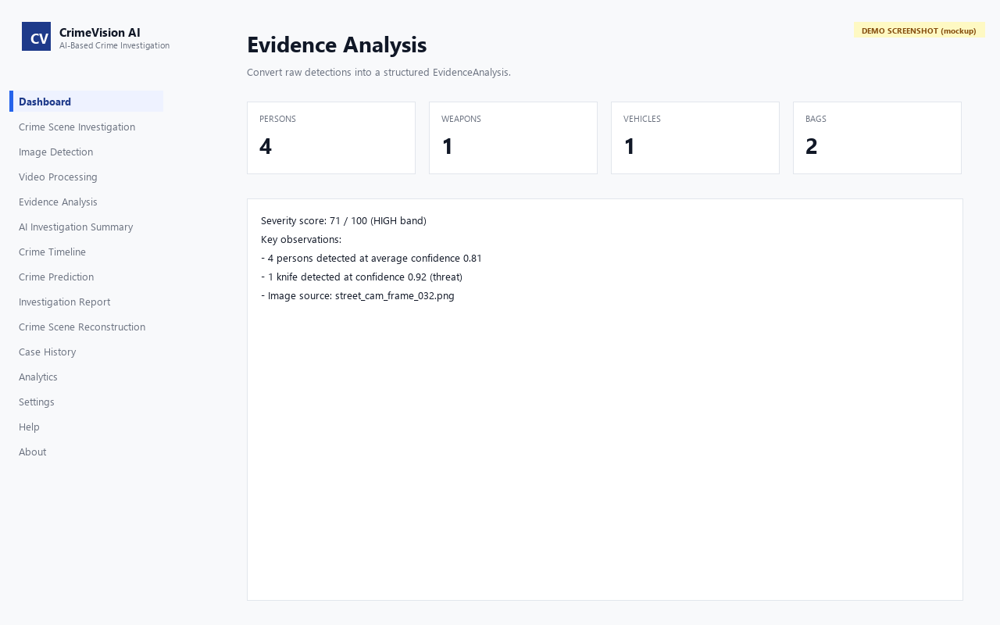
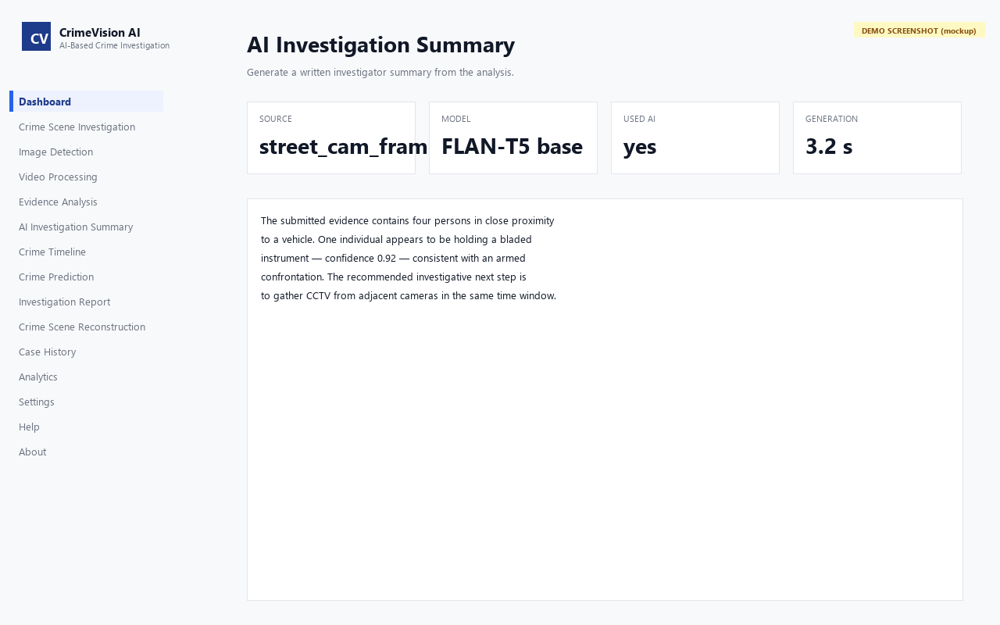
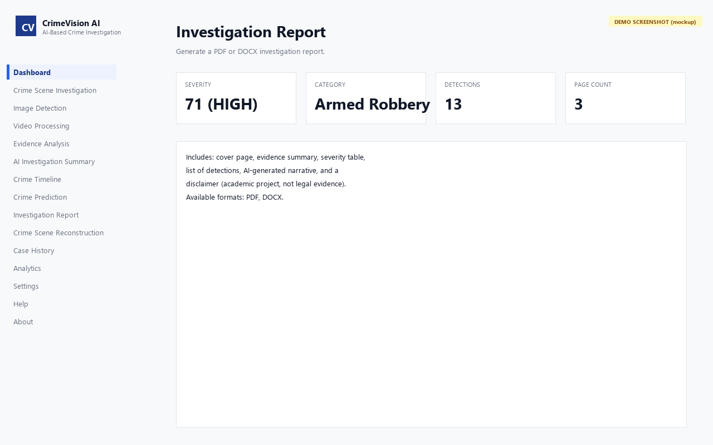
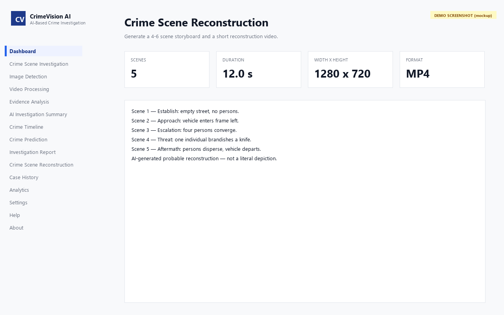
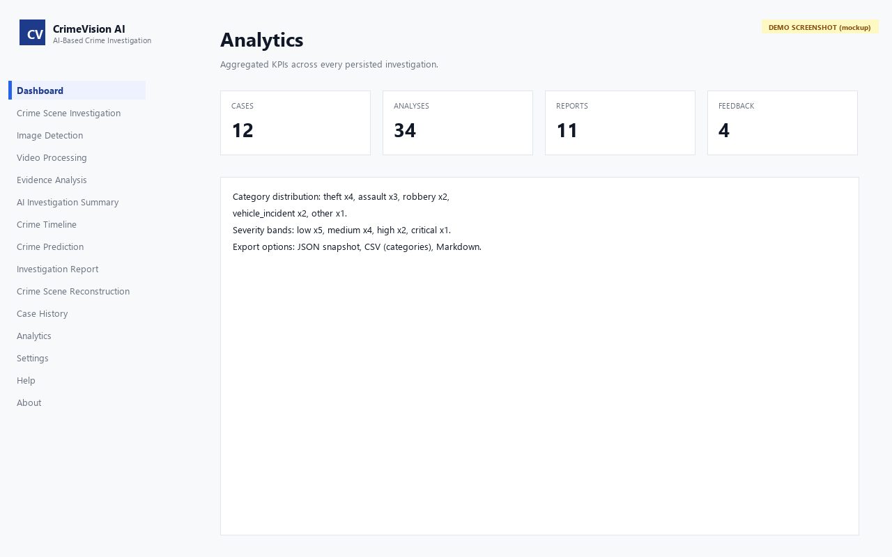

# User Manual

This manual walks you through the **AI Crime Investigation Assistant** from a fresh launch to a downloaded report.

> The images in this manual are **labelled mockups** generated by
> `scripts/render_demo_screenshots.py` — see [the appendix below](#screenshots)
> for the recipe to replace them with real captures from a running
> `streamlit run app.py` session.

## Screenshots

| Page | Image |
|---|---|
| Dashboard |  |
| Evidence Analysis |  |
| AI Investigation Summary |  |
| Investigation Report |  |
| Crime Scene Reconstruction |  |
| Analytics |  |

## 1. Launch the app

### Prerequisites: Local AI Setup
The application uses **Qwen3 14B** for narrative generation and chat. To enable this, you must have **Ollama** installed.

1. Download and install Ollama from [ollama.com](https://ollama.com).
2. Open a terminal and pull the required model:
   ```bash
   ollama pull qwen3:14b
   ```

### Running the App
Pick the path that matches your operating system:

```bash
# macOS / Linux
./scripts/run.sh

# Windows
scripts\run.bat

# Docker (any platform)
docker compose up --build
```

Open <http://localhost:8501> in a browser. YOLOv8 (`yolov8n.pt`) is downloaded on first run and cached on disk.

## 2. The home page

The home page shows the application version, a feature map, and quick links to the most common tasks. Use the left sidebar to navigate to any page.

## 3. Run the analysis pipeline

The professional investigative pipeline is:

| Step | Page | What it does |
|---|---|---|
| 1 | **Image Detection** *or* **Video Processing** | runs YOLOv8 on your evidence |
| 2 | **Evidence Analysis** | converts raw detections into an `EvidenceAnalysis` |
| 3 | **Human Review** | **(HITL)** manually confirm or reject AI detections |
| 4 | **AI Summary** | turns the analysis into a narrative summary via Qwen3 |
| 5 | **Chat Assistant** | ask follow-up questions in plain English |
| 6 | **Crime Timeline** | review the sequence of investigative events |
| 7 | **Crime Prediction** | see a risk distribution across categories |
| 8 | **Report** | download a PDF or DOCX forensic report |
| 9 | **Reconstruction** | generate an AI-driven storyboard + MP4 video |
| 10 | **Case History** | browse everything you’ve ever analyzed |
| 11 | **Settings** | theme, environment, danger-zone reset |

The sidebar shows your progress via the **Pipeline readiness**
panel on the Dashboard once you’ve run at least one analysis.

## 4. Human-in-the-Loop (HITL) Verification

To ensure the report is forensic-grade, you must verify the AI's findings:
1. Open **Human Review** (or the review section in Investigation).
2. Review each detection (e.g., a suspected weapon).
3. Mark as **CONFIRM** (Verified) or **REJECT** (False Positive).
4. These decisions override the AI and are embedded in the final Report.

## 5. Generate an investigation report

1. Run the pipeline through **Evidence Analysis** and **Human Review**.
2. (Optional) Run **AI Summary** so the report can quote it.
3. Open **Report**.
4. The preview section shows the severity, category, and object
   counts that will be embedded.
5. Click **Download PDF report** *or* **Download DOCX report**.
6. The file is also saved to `outputs/reports/` for the case
   history.

## 6. AI-Driven 3D Reconstruction

Instead of manual planning, you can now synthesize a visual reconstruction directly from the AI's narrative:
1. Go to **AI Insights**.
2. Generate a narrative summary.
3. Click the **🚀 Generate 3D Reconstruction from Narrative** button.
4. The app will automatically plan the scenes, render the images, synthesize the MP4 video, and redirect you to the **Reconstruction** page to view the result.

## 7. Managing Outdated Artifacts

If you update the evidence or submit a new human review, any existing summaries, reports, or reconstructions for that case are marked as **OUTDATED**.
- You will see a warning: `⚠️ This report is outdated...`
- Simply click **Regenerate** to update the artifact based on the new truth.

## 8. Switch theme

1. Open **Settings** in the sidebar.
2. Click **Use Light** or **Use Dark**.
3. The page recolours immediately and the choice is remembered
   for the rest of the session.

## 9. Common questions

**Q. I have no GPU. Will it still work?**
A. Yes. The app defaults to CPU. If Ollama is unavailable, the AI Summary and Chat Assistant fall back to a deterministic template system.

**Q. Where do I put my evidence file?**
A. Use the upload widget on the relevant page; the file is
copied into `outputs/videos/` or `outputs/keyframes/` so it
appears in **Case History** for the next run.

**Q. Can I delete a case?**
A. Open **Case History**, click the expander for the case, and
use the **Delete case** button. Deletion cascades to all
related rows.

## Appendix: screenshots

<a id="screenshots"></a>

The screenshot table at the top of this manual uses labelled mockups
generated by `scripts/render_demo_screenshots.py`. To replace any of
them with a real capture of the live app:

1. Launch the app: `streamlit run app.py` (or use
   `./scripts/run.sh` / `scripts\run.bat`).
2. Open the page you want in your browser at
   <http://localhost:8501>.
3. Drive that page to a state representative of the manual:
   upload a sample image and run Image Detection to populate the
   downstream pages, etc.
4. Use any OS screenshot tool to capture the browser window.
5. Save the PNG into `docs/screenshots/` using the same slug as the
   existing mockup. Commit and push.
